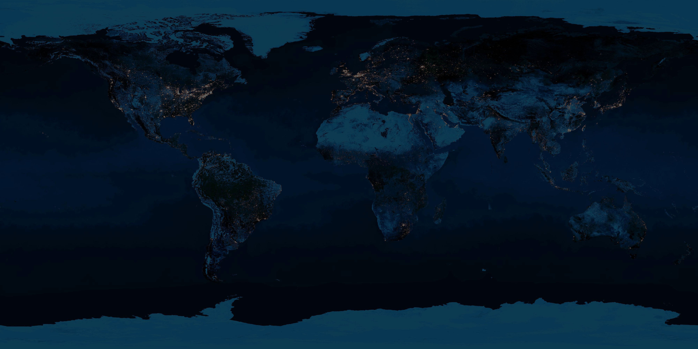

# 🌐 Sonic Globe

**An interactive 3D globe of the world's music.** Spin the Earth, click any country, and instantly hear and browse its top tracks — with smooth camera fly-tos, glassmorphism UI, an animated starfield, and a sleek crossfading audio player.

Built to feel like a premium, cinematic experience rather than a demo.



---

## ✨ Features

- **Interactive 3D globe** (react-globe.gl / three.js) with a realistic night-Earth texture, atmosphere glow, auto-rotation that pauses on hover/interaction, drag-to-spin and scroll-to-zoom.
- **Country markers** that gently glow and raise on hover, with a flag + name tooltip. Clicking flies the camera smoothly to the country (~1.2s ease) and pulses a ring on it.
- **Music panel** — a glass side panel (desktop) / draggable bottom sheet (mobile) showing the **Top 25** tracks with a staggered entrance animation.
- **Audio player** — 30-second previews with a pulsing equalizer, play/pause, next/prev, a scrubable progress bar, and crossfades between tracks. Only one track plays at a time.
- **"Spin the globe"** — jumps to a random country and auto-plays its #1 song.
- **Shareable URLs** — the selected country is reflected as `?c=jp`, so links deep-link straight into a country's music.
- **Polished motion** — intro loading screen, page-load reveal, spring micro-interactions, and full `prefers-reduced-motion` support.
- **Graceful states** — loading skeletons, empty/error states, and stale-response guarding.

## 🧱 Tech Stack

| Concern        | Choice |
| -------------- | ------ |
| Framework      | Next.js 14 (App Router) + TypeScript (strict) |
| 3D globe       | react-globe.gl (three.js) |
| Styling        | Tailwind CSS + custom glassmorphism utilities |
| Animation      | Framer Motion |
| Audio          | Howler.js |
| Data           | Apple Marketing RSS + iTunes Lookup (no keys, no DB) |

## 🎵 Data Strategy — no API keys, no database

All data comes from **free, key-less Apple endpoints**, proxied through Next.js Route Handlers so the browser never hits CORS issues:

1. **Top songs** — Apple Marketing RSS:
   `https://rss.applemarketingtools.com/api/v2/{cc}/music/most-played/25/songs.json`
2. **30s previews + richer metadata** — the song ids from the RSS feed are resolved in a **single batched** iTunes Lookup call:
   `https://itunes.apple.com/lookup?id={id1,id2,…}&country={cc}&entity=song`
   (one request per country, not 25 — fast and gentle on Apple's API). Artwork is upgraded to crisp 512px.

Responses are cached with `revalidate` + `stale-while-revalidate`, and the client keeps an in-session cache so revisiting a country is instant.

See [`lib/apple.ts`](lib/apple.ts) and [`app/api/top/[country]/route.ts`](app/api/top/[country]/route.ts).

## 🚀 Run locally

```bash
npm install
npm run dev
```

Open <http://localhost:3000>.

```bash
npm run build   # production build
npm run start   # serve the production build
npm run lint    # eslint
```

> Requires Node 18.18+ (Node 20+ recommended).

## ☁️ Deploy to Vercel (zero config)

This is a stock Next.js App Router project with **no environment variables and no database**, so it deploys to Vercel's free tier as-is:

1. Push the repo to GitHub.
2. In Vercel, **New Project → Import** the repo.
3. Accept the defaults (Framework: Next.js) and **Deploy**.

Or with the CLI:

```bash
npm i -g vercel
vercel
```

## 🗂️ Project structure

```
app/
  layout.tsx                  # fonts, metadata, root layout
  page.tsx                    # orchestrator: state, URL sync, wiring
  globals.css                 # theme, glass + scrollbar utilities, reduced-motion
  api/top/[country]/route.ts  # RSS + iTunes merge endpoint (cached)
components/
  GlobeScene.tsx              # the 3D globe (client-only)
  StarField.tsx              # animated canvas starfield
  TopBar.tsx                 # wordmark + tagline
  SpinButton.tsx             # "Spin the globe"
  MusicPanel.tsx             # side panel / bottom sheet + track list
  TrackRow.tsx               # a single track row
  Player.tsx                 # floating mini-player
  Equalizer.tsx              # animated equalizer bars
  LoadingScreen.tsx          # intro loader
lib/
  countries.ts               # ~70 Apple storefronts + centroids
  apple.ts                   # server-side data layer
  useAudioPlayer.ts          # Howler-backed single-instance player
  useMediaQuery.ts           # responsive helpers
  types.ts                   # shared types
public/textures/             # Earth textures (served locally)
```

## 📝 Notes

- Earth textures are bundled in `public/textures/` (copied from `three-globe`) so the globe has no runtime CDN dependency.
- Some tracks may have no preview available from Apple; those rows are shown but disabled, and next/prev skip over them.
- Storefront availability and chart contents are Apple's; a country may occasionally return no data, which is handled with a friendly empty state.

---

Made with Next.js, three.js, and a love of music from everywhere. 🎧
